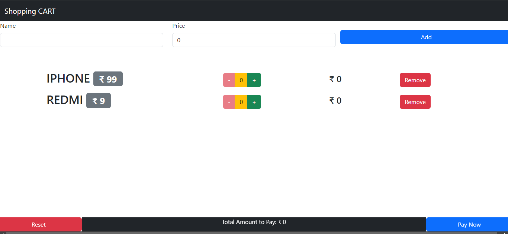

This is a bseic CART model for shopping websites.

Attaching some sample screenshot for the same.

 

Below are the details for the above screenshot:
1. You can add a new item by filling the form available at the top.
2. Below of the form you can see all the items selected for cart. You can increase or decrease the quantity for the  same. Also you can 
   remove from the list from the remove button.
3. With Reset button you can reset the quantity for all the items to original state.
4. with Pay Now button you can proceed to pay and buy the cart items.
